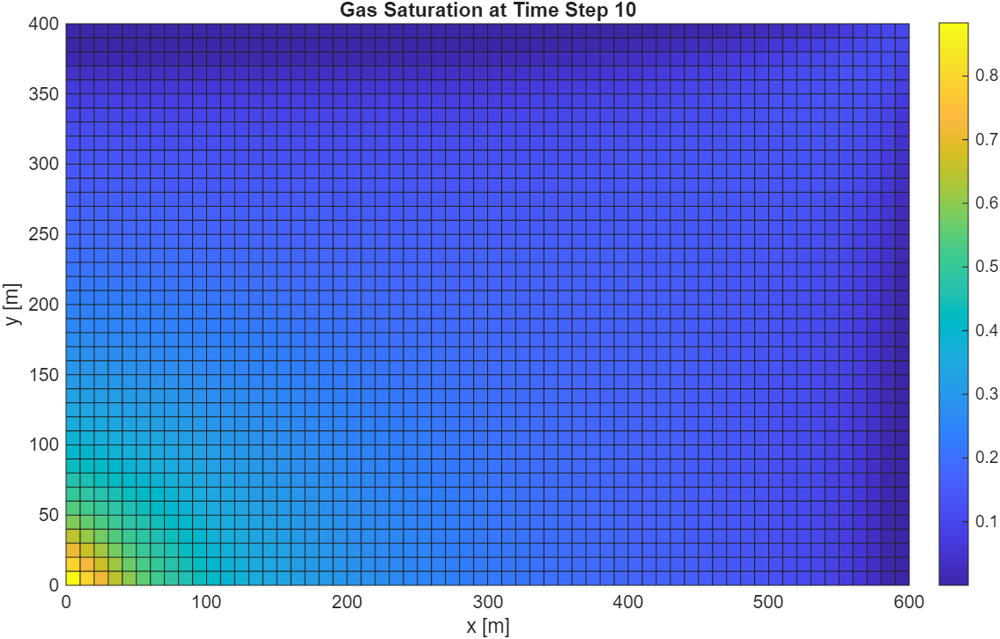

# CO₂ Injection Simulation – Synthetic Reservoir

This project simulates **CO₂ injection into a 2D synthetic oil reservoir** using the MATLAB Reservoir Simulation Toolbox (MRST). It tracks the advance of the injected gas front over time and serves as a base case for gas-injection and enhanced-oil-recovery (EOR) studies.

**Scope note:** this is an oil-filled reservoir with a three-phase water–oil–gas formulation, not a saline aquifer. It models CO₂ as an injected gas phase displacing oil toward a producer, so it is a gas-injection / EOR base case rather than a CO₂ storage simulation. A storage case would require a brine-filled initial state and CO₂–brine physics — dissolution, residual and structural trapping — which are not included here.

---

## Objective

To model and visualise the behaviour of injected CO₂ in a homogeneous synthetic reservoir, and to build practical familiarity with:

- Numerical reservoir simulation in MRST
- Three-phase black-oil formulations
- Subsurface flow and saturation-front visualisation

---

## Tools and Framework

- **MRST version:** 2025a
- **Modules used:** `ad-core`, `ad-blackoil`, `mrst-gui`
- **Model:** `ThreePhaseBlackOilModel`
- **Simulation engine:** automatic differentiation (`simulateScheduleAD`)
- **Language:** MATLAB

---

## Model Setup

| Parameter          | Value                              |
|--------------------|------------------------------------|
| Grid               | 60 × 40 cells (600 × 400 m)        |
| Cell size          | 10 × 10 m                          |
| Porosity           | 0.20 (homogeneous)                 |
| Permeability       | 100 mD (homogeneous)               |
| Initial pressure   | 100 bar                            |
| Initial saturation | 100 % oil (Sw = 0, So = 1, Sg = 0) |

---

## Fluids

Three phases defined with `initSimpleADIFluid`, using quadratic relative permeability (`n = [2, 2, 2]`):

| Phase     | Viscosity (cP) | Density (kg/m³) |
|-----------|----------------|-----------------|
| Water     | 1              | 1000            |
| Oil       | 5              | 700             |
| Gas (CO₂) | 0.05           | 600             |

---

## Well Configuration

- **CO₂ injector** — cell [1, 1], top-left
  - Rate-controlled, 100 m³/day
  - Injected composition: 100 % gas (CO₂)
- **Producer** — cell [60, 40], bottom-right
  - BHP-controlled at 50 bar
  - Producing composition: oil

---

## Simulation Details

- Total simulated time: 100 days
- Ten timesteps of 10 days each
- Gas saturation plotted at each timestep

```matlab
fluid = initSimpleADIFluid('phases', 'WOG', ...
    'mu',  [1, 5, 0.05]*centi*poise, ...   % water, oil, gas (CO2)
    'rho', [1000, 700, 600], ...           % water, oil, CO2
    'n',   [2, 2, 2]);

state0 = initResSol(G, 100*barsa, [0 1 0]);   % [Sw So Sg] - oil-filled

model = ThreePhaseBlackOilModel(G, rock, fluid, 'gas', true);
```

---

## Result – Timestep 10

At timestep 10 the injected gas has advanced from the injector toward the producer.



---

## How to Run

1. Install MRST 2025a and load the required modules:
   ```matlab
   mrstModule add ad-core ad-blackoil mrst-gui
   ```
2. Run `CO2InjectionSimulation.m`
3. Saturation plots update at each timestep

---

## Limitations

- Homogeneous rock properties; no heterogeneity, layering or faults
- Immiscible black-oil treatment — no CO₂ dissolution into brine or oil, no compositional or miscibility effects
- No capillary pressure, hysteresis or residual trapping
- No geomechanics, thermal effects or solubility trapping
- Simple quadratic relative permeability rather than measured curves
- Qualitative saturation visualisation only; no recovery factor, sweep efficiency or storage-capacity calculation

---

## Note

This project was built to develop practical reservoir-simulation skills in MRST. It is a learning exercise, not a research result. Possible extensions include:

- A brine-filled initial state with CO₂–brine physics, to turn this into a storage rather than an injection case
- Water and CO₂ co-injection (WAG-style scheduling)
- Heterogeneous permeability fields
- Recovery-factor and sweep-efficiency tracking

---

## Author

**Anuri Nwagbara**
